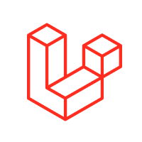

# Hi there 👋

I'm Oscar 😄 I work as a Software Engineer and in the last years I have specialized in frontend. I have a great interest in UX/UI, application and website development. Currently, I work at [Mercado Libre](https://forbes.cl/tag/mercado-libre), the largest e-commerce in Latin America, developing the new streaming platform, [Mercado Play](https://forbes.cl/negocios/2024-02-21/como-la-mayor-tecnologica-de-america-latina-se-esta-lanzando-a-la-conquista-del-video). I also like to contribute to startups and technology ventures 🚀

    
    
    
    
    
    
    
    
    

## Portfolio

See my Frontend Mentor challenge solutions [here](https://github.com/ocarmora?tab=repositories&q=fm&type=&language=&sort=).

## Let's talk?
Send me a message on [LinkedIn](https://www.linkedin.com/in/ocarmora/) 😄
